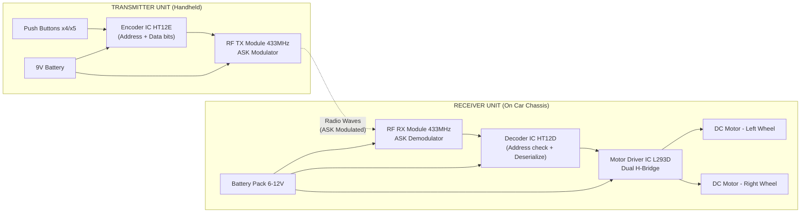
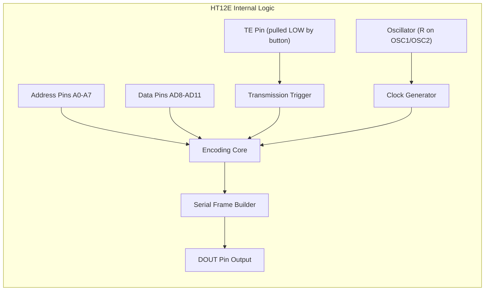
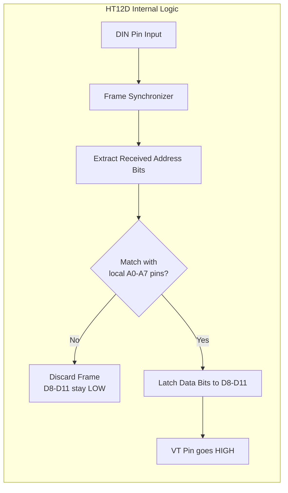
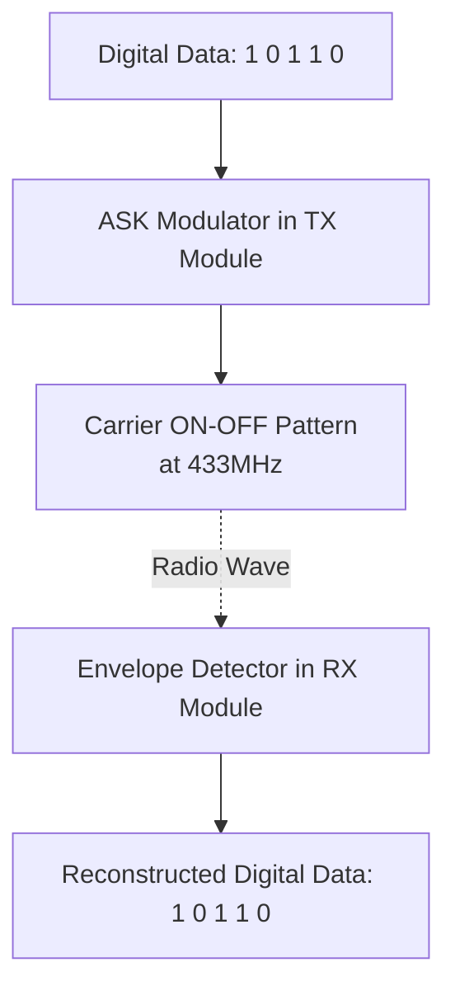
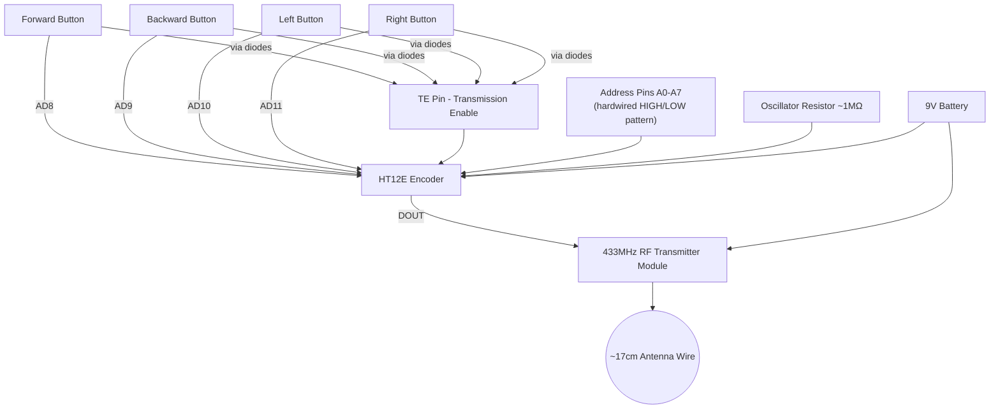
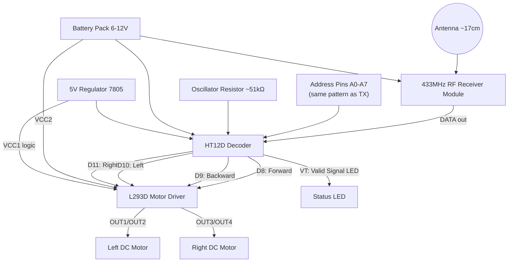
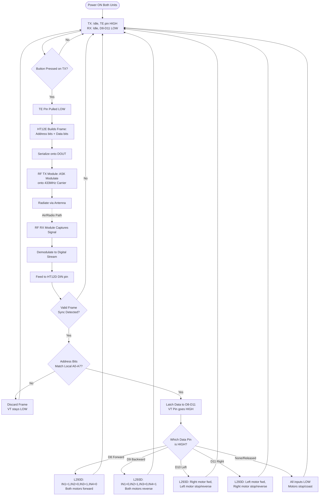

# RF-Control-Robotic-Car
An RF (Radio Frequency) controlled car uses radio signals instead of infrared or Bluetooth to control a robot wirelessly. Unlike IR, RF doesn't need line-of-sight and works over longer range (up to 100+ meters with the right modules), which is why it's popular for these projects.
The system has two halves: a transmitter (handheld remote you control) and a receiver (mounted on the car with Arduino and motors).

A complete, in-depth guide to building an RF (Radio Frequency) controlled robotic car — covering RF theory, IC-level internal working, full circuit design, block diagrams, flowcharts, code logic, testing, troubleshooting, and applications.

---

## Table of Contents

1. [Introduction](#1-introduction)
2. [What is RF and Why Use It](#2-what-is-rf-and-why-use-it)
3. [Working Principle (Detailed)](#3-working-principle-detailed)
4. [Block Diagram](#4-block-diagram)
5. [Components Required (Detailed)](#5-components-required-detailed)
6. [Encoder IC — HT12E (Internal Working)](#6-encoder-ic--ht12e-internal-working)
7. [Decoder IC — HT12D (Internal Working)](#7-decoder-ic--ht12d-internal-working)
8. [RF TX/RX Modules — ASK Modulation Explained](#8-rf-txrx-modules--ask-modulation-explained)
9. [Motor Driver IC — L293D (H-Bridge Explained)](#9-motor-driver-ic--l293d-h-bridge-explained)
10. [Transmitter Section — Full Detail](#10-transmitter-section--full-detail)
11. [Receiver Section — Full Detail](#11-receiver-section--full-detail)
12. [Complete Circuit Diagrams](#12-complete-circuit-diagrams)
13. [Power Supply Design](#13-power-supply-design)
14. [Antenna Design & Range](#14-antenna-design--range)
15. [System Flowchart (Detailed)](#15-system-flowchart-detailed)
16. [Motor Driving Logic & Truth Tables](#16-motor-driving-logic--truth-tables)
17. [Sample Code (Microcontroller-based Receiver)](#17-sample-code-microcontroller-based-receiver)
18. [Step-by-Step Assembly](#18-step-by-step-assembly)
19. [Testing Procedure](#19-testing-procedure)
20. [Troubleshooting Guide](#20-troubleshooting-guide)
21. [Applications](#21-applications)
22. [Advantages & Limitations](#22-advantages--limitations)
23. [Cost Estimate](#23-cost-estimate)
24. [Future Scope](#24-future-scope)

---


## 1. Introduction

An **RF Controlled Robotic Car** is a wireless vehicle operated using radio frequency (RF) signals rather than infrared (IR) or Bluetooth. It is one of the most common beginner-to-intermediate embedded systems/robotics projects because it teaches, in one build:

- Digital encoding/decoding of data
- Wireless RF communication (ASK/OOK modulation)
- Motor control via H-bridge driver ICs
- Basic power electronics

The project is normally built in **two independent, physically separate units** that communicate only through the air:

- **Transmitter (TX) Unit** — a handheld remote with push buttons, carried by the operator.
- **Receiver (RX) Unit** — mounted on the car chassis, receives commands and physically drives the wheels.

There is no wired connection between the two — all communication happens via a 433 MHz (or 315 MHz) radio link.

---

## 2. What is RF and Why Use It

**Radio Frequency (RF)** refers to electromagnetic waves in the range of roughly 3 kHz to 300 GHz that can be used to carry information wirelessly. For hobby robotics, the most common bands are **433 MHz** and **315 MHz** because:

- They are license-free (ISM band) in most countries for low-power use.
- RF TX/RX module pairs are cheap (₹20–₹100 / $0.50–$2).
- They don't need pairing/handshaking like Bluetooth.

**Comparison with other wireless methods:**

| Method | Line of Sight Needed? | Typical Range | Cost | Complexity | Data Rate |
|---|---|---|---|---|---|
| IR (Infrared) | Yes | 5–10 m | Very Low | Very Low | Low |
| RF (433/315 MHz) | No | 50–200 m (open air) | Low | Low-Medium | Low |
| Bluetooth | No | 10–30 m | Medium | Medium | Medium |
| Wi-Fi / ESP based | No | 30–100 m (with router) | Medium | Medium-High | High |
| GSM/GPRS | No | Unlimited (network-dependent) | High | High | Medium |

RF (433 MHz) is chosen for this project because it strikes the best balance of **range, cost, and simplicity** for a basic 4–5 command robot.

---

## 3. Working Principle (Detailed)


Step-by-step signal journey from button press to wheel movement:

1. **Button Press (TX side):** Pressing a button connects a specific pin of the HT12E encoder IC to logic HIGH or LOW, representing one "data" bit combination.
2. **Encoding:** The HT12E converts this parallel button data into a **serial bit stream**, and prefixes it with a fixed **address code** (like a "password" so only the matching receiver responds).
3. **Modulation:** This serial digital stream is fed to the RF transmitter module, which uses **ASK (Amplitude Shift Keying)** — switching the 433 MHz carrier wave ON for a logic '1' and OFF for a logic '0'. This is also called **OOK (On-Off Keying)**.
4. **Radiation:** The antenna radiates this modulated wave into free space.
5. **Reception (RX side):** The RF receiver module continuously listens on 433 MHz. When it detects the ON/OFF pattern, it demodulates it back into the original digital serial stream.
6. **Decoding:** The HT12D decoder receives this stream, checks whether the address bits match its own hardwired address. If they match, it converts the serial data back into **parallel output pins** (VT pin also goes HIGH to confirm valid transmission).
7. **Motor Driving:** The parallel output pins (representing forward/backward/left/right) are fed into the L293D motor driver's input pins, which switches internal transistors (H-bridge) to control current direction through the DC motors.
8. **Mechanical Motion:** The motors rotate in the commanded direction, and the car moves.
```
Button Press
   ↓
Parallel Data → HT12E (adds address bits, serializes)
   ↓
Serial Data Stream
   ↓
RF TX Module (ASK/OOK Modulation onto 433MHz carrier)
   ↓
[ RADIO WAVES THROUGH AIR ]
   ↓
RF RX Module (demodulates back to serial digital stream)
   ↓
HT12D (checks address match, deserializes to parallel)
   ↓
L293D (H-Bridge switches current direction)
   ↓
DC Motors Rotate
   ↓
Car Moves
```

---

## 4. Block Diagram



---

## 5. Components Required (Detailed)

| # | Component | Section | Specification | Purpose |
|---|-----------|---------|----------------|---------|
| 1 | Push Buttons | Transmitter | 4–5, momentary tactile switches | Direction command input |
| 2 | Encoder IC | Transmitter | HT12E (18-pin DIP) | Parallel-to-serial encoding + addressing |
| 3 | RF Transmitter Module | Transmitter | 433 MHz ASK, ~4-pin (VCC, GND, DATA, ANT) | Modulates and radiates signal |
| 4 | RF Receiver Module | Receiver | 433 MHz ASK, ~8-pin (superheterodyne preferred) | Captures and demodulates signal |
| 5 | Decoder IC | Receiver | HT12D (18-pin DIP) | Serial-to-parallel decoding + address validation |
| 6 | Motor Driver IC | Receiver | L293D (16-pin DIP, dual H-bridge) | Bidirectional motor current control |
| 7 | DC Geared Motors | Receiver | 2–4x, 100–300 RPM, 6–12V | Wheel rotation |
| 8 | Robot Chassis | Receiver | 2WD/4WD acrylic or plastic chassis kit | Structural body |
| 9 | Wheels | Receiver | Matched to motor shaft | Traction |
| 10 | Battery (TX) | Transmitter | 9V PP3 battery | Powers remote |
| 11 | Battery Pack (RX) | Receiver | 4x AA (6V) or 2x Li-ion (7.4V) | Powers car electronics + motors |
| 12 | Resistor (750kΩ–1MΩ) | Both | For HT12E/HT12D oscillator | Sets internal clock frequency |
| 13 | Capacitors (10µF, 0.1µF) | Both | Decoupling/filtering | Power supply stabilization |
| 14 | Antenna Wire | Both | ~17.3 cm straight wire (¼ wavelength @433MHz) | Radiates/captures RF signal |
| 15 | Voltage Regulator (7805) | Receiver (optional) | 5V regulation | Steps down battery voltage for logic ICs |
| 16 | Microcontroller (optional) | Receiver | Arduino Uno/Nano or ATmega328 | Adds smart/advanced logic |
| 17 | Berg Sticks / Connectors | Both | Male-female jumper headers | Modular wiring |
| 18 | PCB / Breadboard | Both | General-purpose | Circuit assembly |

---

## 6. Encoder IC — HT12E (Internal Working)

The **HT12E** is a CMOS parallel-to-serial encoder IC, part of the Holtek HT12E/HT12D remote-control pair.

**Pin Overview (18-pin DIP):**

| Pins | Name | Function |
|---|---|---|
| 1–8 | A0–A7 | Address pins (set HIGH/LOW/floating to create up to 3^8 = 6561 unique addresses) |
| 9–12 | AD8–AD11 | Address/Data pins — can act as extra address bits OR as the 4 data input bits (connected to push buttons) |
| 13 | GND | Ground |
| 14 | DOUT | Serial data output → goes to RF TX module's DATA pin |
| 15 | OSC2 | Oscillator pin 2 |
| 16 | OSC1 | Oscillator pin 1 (connects to external resistor, typically 1MΩ, sets internal clock ~3kHz–10kHz) |
| 17 | TE (Transmission Enable) | Active LOW; pulling this LOW starts continuous transmission (usually tied to buttons via diodes so ANY button press pulls TE low) |
| 18 | VCC | Supply voltage (2.4V–12V) |

**How it works internally:**
- HT12E constantly monitors the TE pin.
- When TE is pulled LOW (a button is pressed), the IC begins transmitting a repeating frame:
  `[Preamble][Address bits A0-A7][Data bits AD8-AD11][Sync/Stop bit]`
- This entire frame is sent out serially on DOUT, repeating as long as TE stays LOW (i.e., as long as the button is held).
- Since only one wire (DOUT) carries all this info, it is inherently a **serial protocol** — perfect for single-wire RF transmission.



---

## 7. Decoder IC — HT12D (Internal Working)

The **HT12D** is the receiving counterpart — a serial-to-parallel decoder.

**Pin Overview (18-pin DIP):**

| Pins | Name | Function |
|---|---|---|
| 1–8 | A0–A7 | Address pins — MUST be wired identically to the transmitter's HT12E address pins |
| 9–12 | D8–D11 | Data output pins — go HIGH according to which button was pressed on TX |
| 13 | GND | Ground |
| 14 | DIN | Serial data input ← comes from RF RX module's DATA output |
| 15 | OSC2 | Oscillator pin 2 |
| 16 | OSC1 | Oscillator pin 1 (external resistor ~51kΩ, must be roughly 50x the HT12E's oscillator resistor for correct timing) |
| 17 | VT (Valid Transmission) | Goes HIGH when a correct, address-matched frame is received (useful as an "signal OK" indicator LED) |
| 18 | VCC | Supply voltage |

**How it works internally:**
- HT12D continuously samples the DIN pin.
- It looks for a valid frame structure (preamble + sync).
- It extracts the received address bits and compares them, bit-by-bit, against its own hardwired A0–A7 pins.
- **If addresses match:** the corresponding data bits are latched onto D8–D11, and VT pin goes HIGH.
- **If addresses do NOT match** (e.g., a neighboring remote/other car on the same frequency): the received frame is discarded, D8-D11 stay LOW, VT stays LOW.

This address-matching mechanism is what prevents **cross-talk** — two RF cars built on the same frequency won't interfere with each other as long as their address pins are set differently.



---

## 8. RF TX/RX Modules — ASK Modulation Explained

The RF modules themselves do NOT understand "forward" or "left" — they simply transmit/receive raw ON-OFF electrical pulses as radio waves.

**ASK (Amplitude Shift Keying) / OOK (On-Off Keying):**
- Logic HIGH (1) at the DATA input → carrier wave transmitted at full amplitude ("ON").
- Logic LOW (0) at the DATA input → carrier wave amplitude drops to near-zero ("OFF").
- The receiver module has an internal envelope detector that reconstructs these ON/OFF pulses back into a digital HIGH/LOW stream on its DATA output pin.



**Why this matters for wiring:** Since RF modules only pass along raw digital 1s and 0s, the "intelligence" (addressing, command identification) is entirely handled by the HT12E/HT12D pair — the RF modules are just a wireless wire replacement.

**Typical RF module specs:**

| Parameter | TX Module | RX Module |
|---|---|---|
| Frequency | 433.92 MHz | 433.92 MHz |
| Supply Voltage | 3–12V | 5V |
| Modulation | ASK/OOK | ASK/OOK |
| Range (open air) | 50–200 m | — |
| Output Power | ~10 mW | — |
| Data Pins | 1 (DATA in) | 1 (DATA out) — some modules have 2 identical DATA pins |

---

## 9. Motor Driver IC — L293D (H-Bridge Explained)

DC motors need **current in both directions** through their terminals to spin forward and backward. A microcontroller/decoder pin alone cannot supply enough current, nor can it reverse polarity by itself — this is where the **L293D** (dual H-Bridge driver) comes in.

**What is an H-Bridge?**

An H-Bridge is an arrangement of 4 switches (here, transistors inside the L293D) around a motor, shaped like the letter "H":

```
        +V
        |
   S1---+---S2
   |    M    |
   S3---+---S4
        |
       GND
```

- Closing **S1 and S4** → current flows left-to-right through the motor → rotates **forward**.
- Closing **S2 and S3** → current flows right-to-left through the motor → rotates **backward**.
- Closing **S1 and S2** (or **S3 and S4**) → both motor terminals same potential → **motor stops (brake)**.
- All open → **motor coasts freely (no drive)**.

**L293D Pinout (16-pin DIP) — Key Pins:**

| Pin | Name | Function |
|---|---|---|
| 1 | EN1 (Enable 1) | Enables Motor A (tie HIGH or PWM for speed control) |
| 2 | IN1 | Motor A direction control input 1 |
| 3 | OUT1 | Motor A terminal 1 |
| 4, 5 | GND | Ground (also acts as heatsink pad) |
| 6 | OUT2 | Motor A terminal 2 |
| 7 | IN2 | Motor A direction control input 2 |
| 8 | VCC2 (VS) | Motor supply voltage (up to 36V, separate from logic) |
| 9 | EN2 (Enable 2) | Enables Motor B |
| 10 | IN3 | Motor B direction control input 1 |
| 11 | OUT3 | Motor B terminal 1 |
| 12,13 | GND | Ground |
| 14 | OUT4 | Motor B terminal 2 |
| 15 | IN4 | Motor B direction control input 2 |
| 16 | VCC1 (VSS) | Logic supply voltage (5V) |

**Why L293D is ideal here:** it has 2 independent H-bridges in one chip — enough to control both left and right wheel motors of the car from a single IC, and it includes internal flyback diodes to protect against motor voltage spikes.

---

## 10. Transmitter Section — Full Detail

**Functional description:**
1. Each push button is wired between VCC (or GND) and one of HT12E's AD8–AD11 pins, and also routed (via a diode OR-gate arrangement) to pull the TE pin LOW when any button is pressed.
2. HT12E's address pins (A0–A7) are hardwired (tied to VCC or GND) to a fixed pattern — this becomes the car's unique "ID".
3. An external resistor (~1MΩ) across OSC1/OSC2 sets the internal oscillator frequency, which determines the bit rate of the serial output.
4. DOUT of HT12E connects directly to the DATA pin of the RF TX module.
5. The RF TX module's VCC is powered (typically 9–12V for better range), GND common with HT12E, and ANT pin connects to a ~17cm wire antenna.



---

## 11. Receiver Section — Full Detail

**Functional description:**
1. The RF RX module's antenna (~17cm wire) picks up the incoming 433 MHz signal.
2. The module demodulates it and outputs the recovered serial digital stream on its DATA pin, connected to HT12D's DIN pin.
3. HT12D's address pins (A0–A7) are hardwired **identically** to the transmitter's HT12E address pins.
4. When a valid, address-matched frame arrives, the corresponding D8–D11 pins go HIGH, and VT pin confirms valid reception (often used to light an onboard LED).
5. D8–D11 outputs connect to the IN1–IN4 inputs of the L293D motor driver (in the pairing shown in the truth table below).
6. L293D's OUT1–OUT4 connect to the two DC motors; its VCC2 is powered directly from the motor battery pack (6–12V), VCC1 (logic) from a regulated 5V line.



---

## 12. Complete Circuit Diagrams

### Transmitter Circuit (Full ASCII Schematic)

```
                         +9V (Battery+)
                              |
        ______________________________________
       |            |            |            |
    [A0-A7]      VCC(18)     VCC (RF-TX)      |
    hardwired        |            |            |
    address    ┌─────┴─────┐      |            |
       |       |  HT12E    |      |            |
[Fwd]--AD8(10)-|  ENCODER  |      |            |
[Bwd]--AD9(11)-|           |      |            |
[Lft]--AD10(12)|           |      |            |
[Rgt]--AD11(9)-|           |      |            |
       |       |  DOUT(14) |------|--> DATA (RF TX Module)
[All buttons   |  TE(17)   |
 via diodes]---|  <-- pulled LOW when any pressed
       |       |  OSC1(16)-+--[1MΩ]--+
       |       |  OSC2(15)-+---------+
       |       |  GND(13)  |
       |       └─────┬─────┘
       |             |
      GND -----------+---------- GND(RF-TX) --- ANT(~17cm wire)
```

### Receiver Circuit (Full ASCII Schematic)

```
  ANT(~17cm wire)
        |
   [RF RX Module]
   VCC   GND   DATA
    |     |      |
   +5V   GND     |
    |     |      |
    |     |   DIN(14)
    |     |  ┌────┴─────┐
    |     |  |  HT12D   |
    |     |  | DECODER  |
[Same A0-A7 hardwiring as TX]
    |     |  |          |
    |     |  | D8(9) ---+------> IN1 (L293D)
    |     |  | D9(10)---+------> IN2 (L293D)
    |     |  | D10(11)--+------> IN3 (L293D)
    |     |  | D11(12)--+------> IN4 (L293D)
    |     |  | VT(17) --+------> [Status LED + resistor] --> GND
    |     |  | OSC1(16)-+--[51kΩ]--+
    |     |  | OSC2(15)-+----------+
    |     |  | GND(13)  |
    |     |  └────┬─────┘
    |     |       |
   +5V   GND-----GND

   [L293D Motor Driver]
   VCC1(16,logic 5V)  VCC2(8, motor 6-12V)  GND(4,5,12,13)
        |                    |                    |
       +5V              Battery(+)              Battery(-)

   OUT1(3)---+
             |--- LEFT MOTOR ---+
   OUT2(6)---+                  |
   OUT3(11)--+                  |
             |--- RIGHT MOTOR --+
   OUT4(14)--+
```

> **Critical Note:** Both HT12E and HT12D address pins (A0–A7) must be set to the exact **same pattern** (all tied to VCC, GND, or left floating in matching positions) for the pair to communicate. This is the "pairing code" of the remote and car.

---

## 13. Power Supply Design

Two independent supplies are needed since TX and RX are physically separate:

**Transmitter power:**
- A single 9V PP3 battery is sufficient — powers both HT12E (2.4–12V range) and the RF TX module (3–12V range) directly, no regulator needed.
- Current draw is very low (a few mA), so battery life is long.

**Receiver power:**
- Two separate power needs: **logic circuits** (HT12D, RF RX — need clean 5V) and **motors** (L293D VCC2 — need 6–12V, higher current, noisier supply).
- Best practice: use a **7805 voltage regulator** to derive a clean, stable 5V for HT12D/RF RX/L293D-logic from the main battery pack, while feeding the raw battery voltage directly to L293D's VCC2 (motor supply) pin.
- This separation prevents motor current spikes (back-EMF, brush noise) from resetting or glitching the decoder logic.

```
Battery Pack (7.4V-12V)
     |
     +----------------------------+
     |                            |
 [7805 Regulator]            (direct, unregulated)
     |                            |
   +5V Clean                  VCC2 (L293D, motor power)
     |
  Powers: RF RX module, HT12D, L293D VCC1 (logic)
```

**Recommended decoupling:** place a 10µF electrolytic capacitor + 0.1µF ceramic capacitor across VCC-GND of each IC, close to the pins, to filter switching noise from the motors.

---

## 14. Antenna Design & Range

The simplest and most effective antenna for 433 MHz modules is a **quarter-wave monopole**:

```
Antenna Length = c / (4 x f)
               = (3x10^8 m/s) / (4 x 433x10^6 Hz)
               ~= 0.173 m
               ~= 17.3 cm
```

- Use a single straight wire (~17.3 cm), soldered to the ANT pad of the RF module.
- Keep it as straight and vertical as possible; avoid coiling it (coiling reduces efficiency significantly).
- Keep the antenna away from metal chassis parts/motor bodies, which can shield or detune it.
- Typical achievable range: **15–30 m indoors** (with walls/obstacles), **80–150 m outdoors** (open line of sight), assuming a good quality superheterodyne RX module (superregenerative modules give roughly half this range but cost less).

---

## 15. System Flowchart (Detailed)



---

## 16. Motor Driving Logic & Truth Tables

**L293D truth table (per the HT12D data outputs):**

| Command  | D8 | D9 | D10 | D11 | IN1 | IN2 | IN3 | IN4 | Left Motor | Right Motor | Car Action |
|----------|----|----|----|-----|-----|-----|-----|-----|------------|--------------|------------|
| Forward  | 1  | 0  | 0  | 0   | 1   | 0   | 1   | 0   | Forward    | Forward      | Moves Forward |
| Backward | 0  | 1  | 0  | 0   | 0   | 1   | 0   | 1   | Reverse    | Reverse      | Moves Backward |
| Left     | 0  | 0  | 1  | 0   | 0   | 1   | 1   | 0   | Reverse/Stop | Forward    | Turns Left |
| Right    | 0  | 0  | 0  | 1   | 1   | 0   | 0   | 1   | Forward    | Reverse/Stop | Turns Right |
| Stop (no button) | 0 | 0 | 0 | 0 | 0 | 0 | 0 | 0 | Stop | Stop | Stationary |

**Single L293D H-bridge truth table (general reference, Motor A):**

| IN1 | IN2 | Motor A Behavior |
|---|---|---|
| 0 | 0 | Motor stops (coasts) |
| 1 | 0 | Rotates Forward |
| 0 | 1 | Rotates Reverse |
| 1 | 1 | Brake (both terminals same potential) |

*(EN1 must be HIGH for any of the above to take effect — if EN1 is LOW, motor is always off regardless of IN1/IN2.)*

---

## 17. Sample Code (Microcontroller-based Receiver)

If you replace direct HT12D-to-L293D wiring with a microcontroller (e.g., Arduino) for more flexible logic (e.g., turning + moving simultaneously, adding speed control via PWM):

```cpp
// ---- Inputs from HT12D data pins ----
#define D8  2   // Forward
#define D9  3   // Backward
#define D10 4   // Left
#define D11 5   // Right

// ---- Outputs to L293D ----
#define IN1 6
#define IN2 7
#define IN3 8
#define IN4 9
#define ENA 10  // PWM speed control, Motor A
#define ENB 11  // PWM speed control, Motor B

void setup() {
  pinMode(D8, INPUT); pinMode(D9, INPUT);
  pinMode(D10, INPUT); pinMode(D11, INPUT);

  pinMode(IN1, OUTPUT); pinMode(IN2, OUTPUT);
  pinMode(IN3, OUTPUT); pinMode(IN4, OUTPUT);
  pinMode(ENA, OUTPUT); pinMode(ENB, OUTPUT);

  // Full speed by default; change value (0-255) to slow down
  analogWrite(ENA, 200);
  analogWrite(ENB, 200);
}

void stopCar() {
  digitalWrite(IN1, LOW); digitalWrite(IN2, LOW);
  digitalWrite(IN3, LOW); digitalWrite(IN4, LOW);
}

void moveForward() {
  digitalWrite(IN1, HIGH); digitalWrite(IN2, LOW);
  digitalWrite(IN3, HIGH); digitalWrite(IN4, LOW);
}

void moveBackward() {
  digitalWrite(IN1, LOW); digitalWrite(IN2, HIGH);
  digitalWrite(IN3, LOW); digitalWrite(IN4, HIGH);
}

void turnLeft() {
  digitalWrite(IN1, LOW); digitalWrite(IN2, HIGH);  // left motor reverse/stop
  digitalWrite(IN3, HIGH); digitalWrite(IN4, LOW);  // right motor forward
}

void turnRight() {
  digitalWrite(IN1, HIGH); digitalWrite(IN2, LOW);  // left motor forward
  digitalWrite(IN3, LOW); digitalWrite(IN4, HIGH);  // right motor reverse/stop
}

void loop() {
  if (digitalRead(D8) == HIGH)        moveForward();
  else if (digitalRead(D9) == HIGH)   moveBackward();
  else if (digitalRead(D10) == HIGH)  turnLeft();
  else if (digitalRead(D11) == HIGH)  turnRight();
  else                                 stopCar();
}
```

**Explanation of additions over the basic version:**
- `ENA` / `ENB` are PWM-capable pins used to control motor **speed**, not just direction — set anywhere from 0 (off) to 255 (full speed).
- Direction functions are broken out for readability and reusability (useful if you later add obstacle-avoidance overrides).

---

## 18. Step-by-Step Assembly

1. **Build the transmitter first** (easier to test standalone with an LED on DOUT to visually confirm pulses when a button is pressed).
2. Solder/breadboard HT12E: hardwire A0–A7 to a chosen address pattern; wire push buttons to AD8–AD11 and to TE (via diodes so any button pulls TE low); add 1MΩ oscillator resistor.
3. Connect HT12E DOUT to RF TX module's DATA pin; power both from 9V; attach ~17cm antenna wire to TX module's ANT pad.
4. **Build the receiver:** wire HT12D with the exact same A0–A7 address pattern as the transmitter; add ~51kΩ oscillator resistor; attach ~17cm antenna to RF RX module.
5. Connect RF RX module's DATA output to HT12D's DIN pin.
6. Connect HT12D's D8–D11 outputs to L293D's IN1–IN4 inputs (or to a microcontroller if using the code-based approach).
7. Wire L293D outputs (OUT1–OUT4) to the two DC motors; connect VCC2 to the main battery pack and VCC1 (logic) to a regulated 5V.
8. Mount motors, wheels, battery pack, and receiver circuit onto the chassis.
9. Double-check all grounds are common within each unit (TX ground together, RX ground together — TX and RX do NOT share a ground, they are wireless).
10. Power on both units and proceed to Testing (Section 19).

---

## 19. Testing Procedure

1. **Power-on test:** Confirm both TX and RX units power up (check with a multimeter that VCC pins read expected voltage).
2. **VT LED test:** Press any button on the TX remote — the VT pin LED on the receiver should light up, confirming the RF link and address-matching are both working.
3. **Individual motor test:** Before mounting to chassis, test each DC motor spins correctly forward/backward when the corresponding button is pressed, with wheels off the ground.
4. **Range test:** Walk away from the car while pressing buttons to determine practical operating range in your environment.
5. **Full integration test:** Place car on the ground and test forward, backward, left, right, and stop commands in sequence.

---

## 20. Troubleshooting Guide

| Symptom | Likely Cause | Fix |
|---|---|---|
| Car doesn't respond at all | Address mismatch between HT12E and HT12D | Verify A0-A7 wiring is identical on both ICs |
| VT LED never lights up | RF modules not powered / antenna missing | Check TX/RX module VCC, GND, and antenna connections |
| VT LED flickers randomly with no button press | RF interference from other 433MHz devices | Change address pattern; shield receiver; add decoupling capacitors |
| One motor doesn't spin | Faulty wiring on that H-bridge channel, or dead motor | Swap motor to other channel to isolate; check L293D pin continuity |
| Motors spin but very weakly | Insufficient VCC2 voltage/current, weak battery | Use a higher-current battery pack; check L293D isn't overheating |
| Car moves opposite to expected direction | Motor wires swapped, or IN pin logic reversed | Swap the two motor terminal wires, or swap IN1/IN2 in code/wiring |
| Short range (<10m) | Poor antenna (coiled, too short, near metal) | Use straight 17.3cm wire antenna, keep away from chassis metal |
| Receiver resets/glitches when motors run | Motor electrical noise feeding back into logic supply | Add separate regulator for logic vs motor supply; add capacitors |
| No response only when TX button held long | Weak TX battery, encoder brown-out | Replace 9V battery |

---

## 21. Applications

- Wireless surveillance and inspection robots
- Military/defense reconnaissance vehicle prototypes
- Industrial material-handling robots in hazardous zones (radiation, chemical, fire-risk areas)
- Educational robotics and embedded systems learning projects
- Remote-controlled toy cars
- Disaster management (rubble/collapsed-building inspection robots)
- Base platform for further robotics extensions (line-follower, obstacle avoider, FPV rover)

---

## 22. Advantages & Limitations

**Advantages:**
- No line-of-sight required, unlike IR remotes
- Longer range than IR/Bluetooth in open areas
- Can pass through non-metallic obstacles/walls to some degree
- Low cost, simple circuitry, no software/pairing needed
- Address-coding prevents accidental cross-control between nearby units

**Limitations:**
- Limited range compared to Wi-Fi/GSM-based control
- Susceptible to interference from other 433 MHz devices (garage door openers, weather stations, etc.)
- No feedback path from car to controller — it's a fully **open-loop** system (no telemetry, no confirmation the command was executed)
- Fixed, small number of commands limited by encoder/decoder data pins (4 in the basic HT12E/HT12D setup)
- ASK/OOK modulation is more prone to noise-induced false triggers than more advanced modulation schemes (FSK, GFSK)

---

## 23. Cost Estimate (Approximate, Hobbyist Pricing)

| Item | Approx. Cost (INR) | Approx. Cost (USD) |
|---|---|---|
| HT12E + HT12D pair | Rs.40-60 | $0.50-0.75 |
| RF TX+RX module pair (433MHz) | Rs.60-120 | $0.75-1.50 |
| L293D Motor Driver IC | Rs.40-70 | $0.50-0.85 |
| DC Geared Motors (x2) | Rs.120-200 | $1.50-2.50 |
| Chassis + Wheels kit | Rs.200-350 | $2.50-4.25 |
| Battery + holder (both units) | Rs.150-250 | $2-3 |
| Misc (resistors, wires, connectors, PCB) | Rs.100-150 | $1.25-1.85 |
| **Approx. Total** | **Rs.700-1200** | **$9-14** |

*(Prices vary significantly by region and vendor; microcontroller-based versions add Rs.300-600 / $4-7 for the board.)*


---

## 24. Future Scope

- Add a camera module with wireless video transmission for FPV (first-person view) control
- Integrate ultrasonic/IR obstacle-avoidance sensors for semi-autonomous behavior
- Replace HT12E/HT12D with a microcontroller + NRF24L01 (2.4GHz) module for bidirectional data, longer range, and telemetry (battery level, sensor readings back to remote)
- Add a GPS module for location tracking and geofencing
- Bridge control through a mobile app via an RF-to-Wi-Fi (ESP8266/ESP32) gateway for smartphone-based control
- Upgrade modulation from ASK/OOK to FSK for better noise immunity and range
- Add encoders on wheels for closed-loop speed/distance control

---
## License

This project documentation is free to use and modify for educational purposes.
